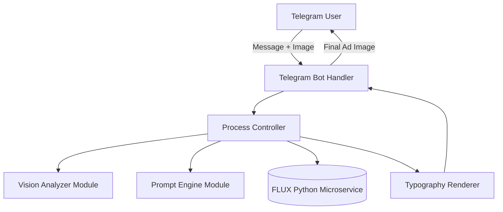

# System Architecture

## Overview

The system is designed with a **modular architecture** following the Single Responsibility Principle. It separates concerns between handling external triggers (Telegram), orchestrating workflows, calling external APIs (Vision, Prompting), rendering images (Typography), and generating raw images (Python FLUX Microservice).

## High-Level Diagram

## Folder Structure & Responsibilities

- **`src/bot/`**: Telegram bot entry point, handlers, and middlewares. It only knows how to receive messages and reply to them.
- **`src/vision/`**: Analyzes competitor images. It interfaces with external vision models or local models to extract visual styles.
- **`src/ai/`**: Prompt generation engine. Interfaces with Groq to construct professional image prompts.
- **`src/rendering/`**: Handles typography and composition. Uses `canvas` or `sharp` to composite Arabic text over the generated imagery.
- **`src/services/`**: External API clients (`groqClient.ts`, `fluxClient.ts`, `telegramClient.ts`).
- **`src/api/`**: Optional REST API layer if webhooks or an external dashboard are needed.
- **`src/core/`**: Core types, constants, and application state definitions.
- **`src/config/`**: Centralized configuration management and environment variable validation.
- **`src/utils/`**: Reusable helper functions (logging, file system helpers, etc.).
- **`src/infrastructure/`**: Database connections, Redis queues (for future image generation tasks), and structural code.
- **`microservices/flux-generator/`**: Isolated Python service containing the FLUX image generation logic, accessible via HTTP or GRPC.
- **`tests/`**: Unit, integration, and end-to-end tests for all modules.

## Key Architectural Decisions

1. **Microservice for Image Generation:** Node.js orchestrates the flow, but running local ML models (FLUX) is best suited for Python. The image generation is isolated as a standalone microservice to ensure scalability. It can run on a separate GPU server if needed.
2. **Environment Configuration:** No secrets in code. Everything is validated on startup through `src/config/env.ts`.
3. **Typography Rendering:** We separate image generation from typography. FLUX is notoriously inadequate at generating Arabic text accurately. We generate the background image first and overlay the typography accurately using Node Canvas.
4. **Queue-Ready:** Currently the orchestration happens synchronously within the bot handler, but the separation into handlers and orchestrators sets the stage for introducing a message queue (e.g. BullMQ) for heavy generations.

## Scalability and Future-proofing

- **Multiple AI Models**: Adding a new AI model simply involves writing a new service in `src/services/` and adapting `src/ai/`.
- **Queues**: If generation load increases, an infrastructure queue module (`src/infrastructure/queue.ts`) can broker jobs between the bot and the FLUX microservice.
- **Brand Presets**: The prompt configuration supports injecting dynamically loaded user preferences or templates without hacking core prompt logic.

